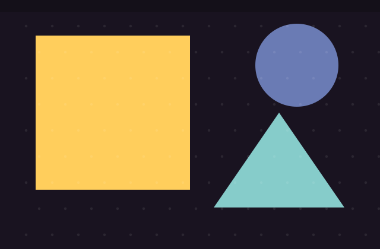

# Ryan · 个人网站

iOS 开发的静态个人网站，使用 HTML、CSS 和原生 JavaScript，无构建步骤，部署于 GitHub Pages：<https://lzylsq.github.io/>。

网站默认采用原创黑白漫画分镜视觉（斜切画格、墨线、速度线、网点），可切换至冷白、深蓝、珊瑚红与浅青的彩色刊载版。黑白／暗色与彩色／明亮由同一个无文字按钮切换，并跨页面记住选择；站内插画为本项目原创 SVG（`assets/images/ryan-manga-action*.svg` 为人物特写，`assets/images/ink-burst.svg` 为按固定随机种子生成的放射墨线），不使用参考图或带水印的素材。**个人资料和项目文字独立撰写**。目前有两个项目介绍，**尚未正式发布文章**；文章页 `post.html` 只是排版示例，不计作已发布内容。

## 页面

| 文件 | 内容 |
| --- | --- |
| `index.html` | 首页导览、轮播入口与写作空状态 |
| `projects.html` | 两个练习项目的总览与独立详情入口 |
| `search.html` | 搜索站内实际页面及已发布文章（不收录排版示例） |
| `data-pipeline.html` | 订单数据分析与推荐练习的技术路径 |
| `law-design.html` | LawDesign 练习的技术路径 |
| `posts.html` | 文章列表／搜索；目前诚实显示空状态 |
| `about.html` | 个人简介、接触过的技术、邮箱与 GitHub |
| `post.html` | **未发布**的文章排版示例，已设置 `noindex` |

主导航的首页、代码人生、文章、关于我分别跳转独立页面；项目总览的入口分别进入独立的技术记录页。旧的 `projects.html#data-pipeline`、`projects.html#law-design` 链接仍可定位到对应总览卡片；旧的 `index.html#projects` 链接会自动转到项目页。关于页可复制邮箱、分享页面链接（系统分享不可用时使用剪贴板）；不支持剪贴板时会明确提示。首页封面仅手动切换：箭头、圆点或手机左右划动；不会自动轮播。画风切换同时决定明暗主题：黑白原稿为暗色，彩色刊载为明亮；选择会在各页面记住。顶栏「本站数据」面板从实际项目卡与正式文章卡实时汇总内容图表及项目流程标签数，不采集访客，不伪造访问量；无法读取时显示错误而非零。搜索在站内已存在的项目记录、个人介绍及正式发布的文章卡片中查找（不把排版示例算作文章），`Ctrl/⌘+K` 聚焦、手机点放大镜展开；搜索需要 JavaScript，关闭时页面明确提示并提供直接入口。文章页的旧 `?s=` 查询和文章标签筛选仍可使用。文章详情提供阅读进度、目录高亮和代码复制。

## 发布第一篇文章

1. 复制 `post.html` 为一个新文件；建议先把新文件放在网站根目录。若放进子目录（例如 `posts/my-first-note.html`），需把 CSS、JS、图片及站内链接的相对路径对应改为 `../`。
2. 修改标题、描述、HTML 正文、实际发布日期和分类；**从正式文章删掉** `<meta name="robots" content="noindex,follow">`。不要再沿用“排版示例”字样。
3. 在 `posts.html` 的 `<div class="post-stack" id="post-list" data-post-list>` 中加入一张真实文章卡。标题、摘要、分类、日期及目标链接都填真实信息；若没有真实封面，可以继续使用几何装饰图，但不要把它当作项目截图；标签链接可写作 `<a href="posts.html#post-list" data-tag="Swift">Swift</a>`。发布后文章页才显示「最近发布」与「文章标签」侧栏，两项内容会按卡片自动生成；站内搜索也会从真实文章卡片提取索引。
卡片骨架（放进 `data-post-list` 容器；以下只是填写格式，不是已发布内容）：

```html
<article class="post-card">
  <a class="post-card-media" href="你的文章文件.html">
    
  </a>
  <div class="post-card-body">
    <h3><a href="你的文章文件.html">你的文章标题</a></h3>
    <p>你实际写好的摘要</p>
    <div class="card-meta">
      <div class="tags-list"><a href="posts.html#post-list" data-tag="真实分类">真实分类</a></div>
      <span>真实发布日期</span>
    </div>
  </div>
</article>
```

4. 发布以后，删除 `posts.html` 中的 `[data-empty-publications]` 提示块，并更新文章页标题下方的空状态说明。若希望首页显示最新文章，也将 `index.html` 的 `.empty-publications` 换为真实文章预览。
5. 若首页有新的轮播内容，记得在 `.hero-dots` 中添加对应 `data-hero-dot` 按钮；目前三张内容分别指向关于页、数据项目、AI 项目。

两个项目的真实 GitHub 仓库链接分别在项目卡与详情页，均明确标注为私有；访客没有权限时仍可阅读公开的技术记录，或发邮件联系。项目内容要以实际代码和自己的更新为准，避免把规划中的链路写成已上线的成果。

## 外观与维护

- 漫画分镜与黑白／彩色配色：`css/style-comic.css`；放射墨线、按钮和窄屏触控优化：最后加载的 `css/style-comic-upgrade.css`。参考图只用于构图方向，没有作为网站素材；黑白版包含导航栏等全局界面均为灰阶，仅画风切换键保留与彩色版相同的四种主题色；彩色版切换键回到黑白；按键以放射／收束波纹切换全页（不支持页面过渡或选择减少动画时立即切换）。首页翻页时画格和对白从相反方向入场。切换逻辑在 `js/comic-mode.js`。明暗主题与漫画画风是同一个开关，由 `js/comic-mode.js` 一起切换。`css/style-memphis.css` 保留原有页面布局与兼容规则；修改时请同时检查黑白暗色／彩色明亮两种模式及桌面与手机对比度。
- 个人资料：`index.html`、`about.html`、`posts.html`、`projects.html` 及各页页脚；联系方式还在导航的「更多」菜单及页眉邮件入口。
- 图片：`assets/images/` 中的几何图是装饰素材，并非真实项目截图；要展示项目实际画面请自行替换。
- 页面交互：`js/theme.js`；本站数据：`js/site-stats.js`；站内搜索索引：`js/site-search.js`。无外部 JavaScript 依赖。

本地预览：

```bash
python3 -m http.server 8000
# 打开 http://localhost:8000
```

仓库 `LzyLsq.github.io` 使用 `main` 分支根目录部署 GitHub Pages，推送后通常需要短暂等待生效。
